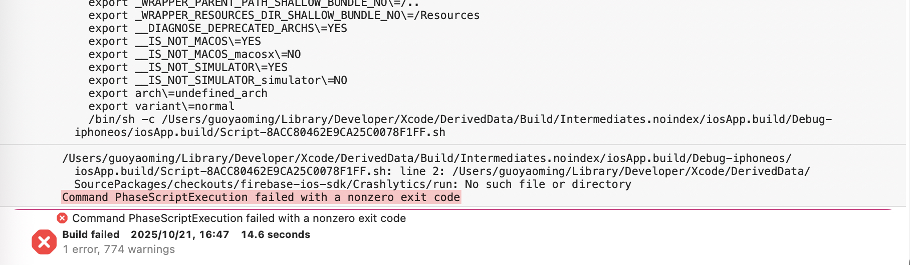

### 【iOS】为什么执行pod install后，构建流程会被删除掉？

> From issue https://github.com/JetBrains/compose-multiplatform/issues/4720

1. `mkdir -p ./composeApp/build/compose/ios/SharedComposables/compose-resources`
2. `./gradlew generateDummyFramework`
3. `./gradlew podspec`
4. `cd ./iosApp && pod install`


### 【iOS】为什么会提示找不到 Pod_iOSApp ?


只能打开work工程文件


### 【iOS】为什么 Upload dSYM file 阶段报错 No such file or directory？



1. 在 Xcode 中 Cmd+Shift+K 移除构建缓存
2. `killall Xcode`
3. `rm ~/Library/Preferences/com.apple.dt.XCode.plist`
4. `rm -rf ~/Library/Developer/Xcode/DerivedData/`
5. 重新打开 Xcode，等待 Xcode checkout SPM 依赖
6. 重新构建，应该没问题了

参见：
[Xcode wrong BUILD_DIR path](https://medium.com/@haikampardjian/xcode-wrong-build-dir-path-85e3102443a8)

### 【iOS】提示缺少iTMSTransporter

> iTMSTransporter 是苹果提供的一个上传IPA的命令行工具，需要手动下载

下载： https://help.apple.com/itc/transporteruserguide/en.lproj/static.html

配置：

```zsh
export TRANSPORTER_HOME=/Applications/Transporter.app/Contents/itms
export PATH=${PATH}:${TRANSPORTER_HOME}/bin
```
