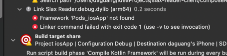
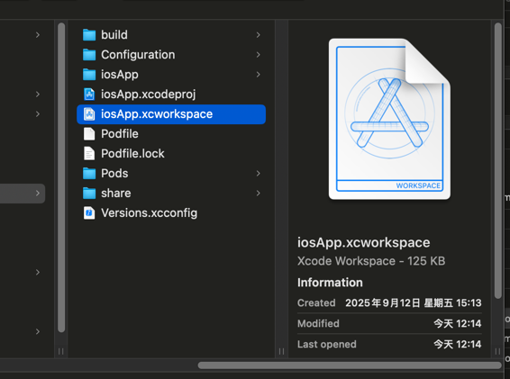

### 为什么执行pod install后，构建流程会被删除掉？

> From issue https://github.com/JetBrains/compose-multiplatform/issues/4720

1. `mkdir -p ./composeApp/build/compose/ios/SharedComposables/compose-resources`
2. `./gradlew generateDummyFramework`
3. `./gradlew podspec`
4. `cd ./iosApp && pod install`

### 为什么会提示找不到 Pod_iOSApp ?

只能打开work工程文件